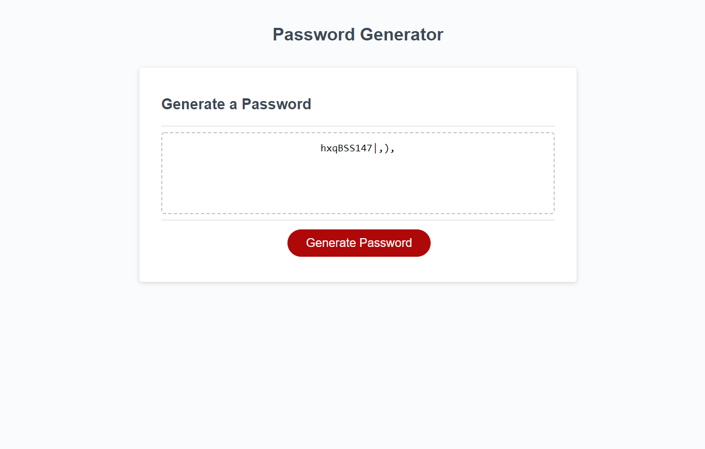

# jsPasswordGen
[Lives Here](https://github.com/devonp702/jsPasswordGen)
[Deployed Here](https://devonp702.github.io/jsPasswordGen/)

## Introduction
Website uses javascript to create a unique custom password when button is pushed. 
script.js written by Devon Phillips, the rest was here already.

## Password Creation
This generator makes a password by getting a number of random characters from a list of types chosen by the user. It then randomizes them into it's final form.